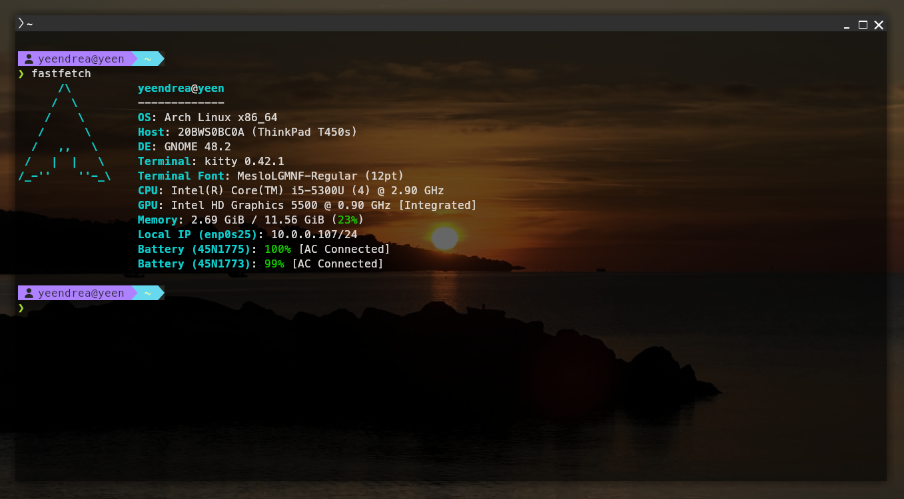

<div align="center">
<h1>My dotfiles</h1>
<h4>In this repository you will find my configuration files for terminal emulators, window managers, code editors, color themes etc.</h4>


<h3>Main Device</h3>
<h4>My main device is a Lenovo ThinkPad T450s. Currently running Windows 11 Pro. However, I will replace it with Arch Linux soon.</h4>
<h2>Screenshots</h2>
Native Arch with Gnome on T450s



<h2>Fonts</h2>

```bash
yay -S ttf-meslo-nerd
```
<h2>Prompts</h2>
<h2>PowerShell prompt installation</h2>

Installing the styles for PowerShell can be a bit more compilacted than just copying to **`~/.bashrc`**

</div>

1. First you need to install **Oh My Posh**:  

```powershell
winget install JanDeDobbeleer.OhMyPosh -s winget
```
2. **Oh My Posh** uses special icons which need some type of **Nerd Font**    
Download a font you like from [Nerd Fonts Downloads](https://www.nerdfonts.com/font-downloads),install it globally on your PC and set it as a default font for your PowerShell terminal. I recommend **Fira Code Nerd Font**

4. Clone this repository
```bash
git clone https://github.com/andreansx/dotfiles ./dotfiles
```
4. Find you profile path
```powershell
$PROFILE
```
5. Create a directory for your profile
```powershell
New-Item -ItemType Directory -Path (Split-Path $PROFILE) -Force
```
6. Let's say you cloned this repo to `~/dotfiles`  
You need to clone the profile file, for example the **[`Microsoft.PowerShell_profile.ps1`](./PowerShell/Microsoft.PowerShell_profile.ps1)**:
```powershell
Copy-Item "./dotfiles/PowerShell/<NAME_OF_FILE_HERE>.ps1" -Destination $PROFILE -Force
```
And clone the theme file like **[`win11-main.omp.json`](./PowerShell/win11-main.omp.json)**
```powershell
Copy-Item "./dotfiles/PowerShell/<NAME_OF_FILE_HERE>.omp.json" -Destination (Join-Path (Split-Path $PROFILE) "<NAME_OF_FILE_HERE>.omp.json") -Force
```
7. Reload PowerShell
```powershell
. $PROFILE
```
