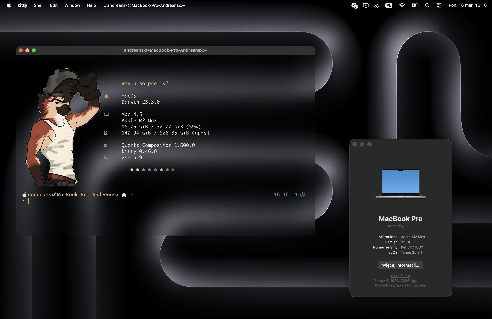
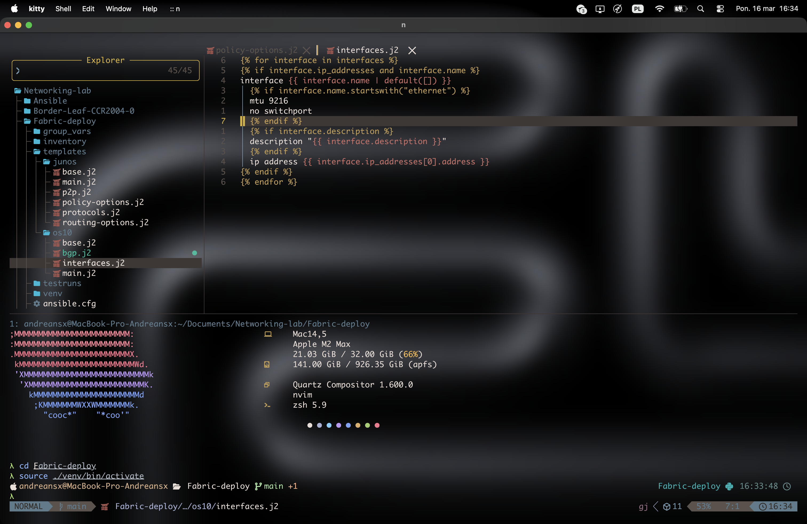
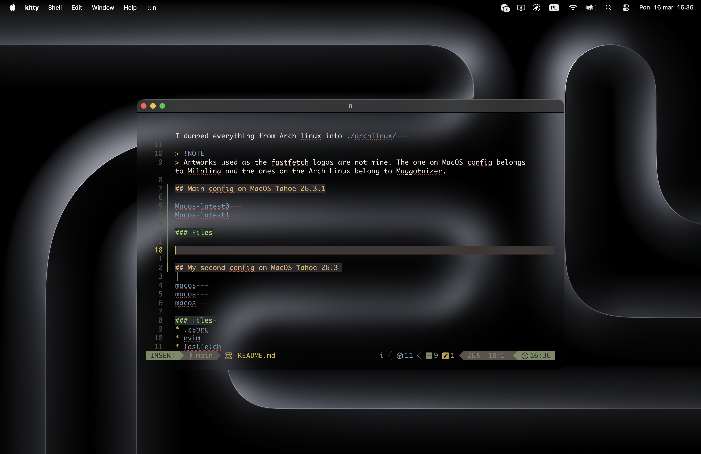
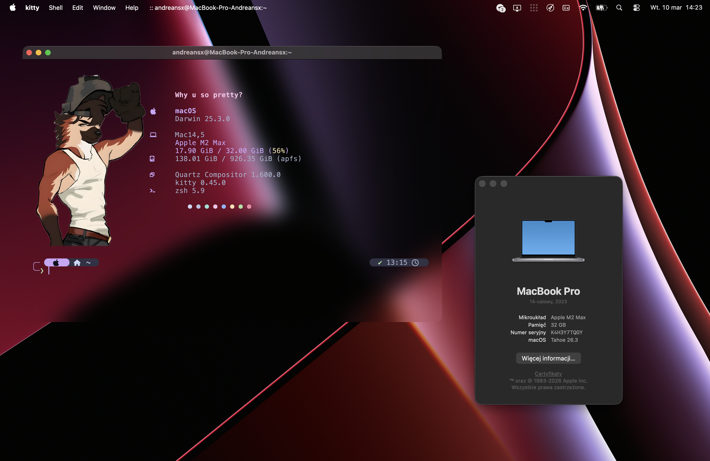
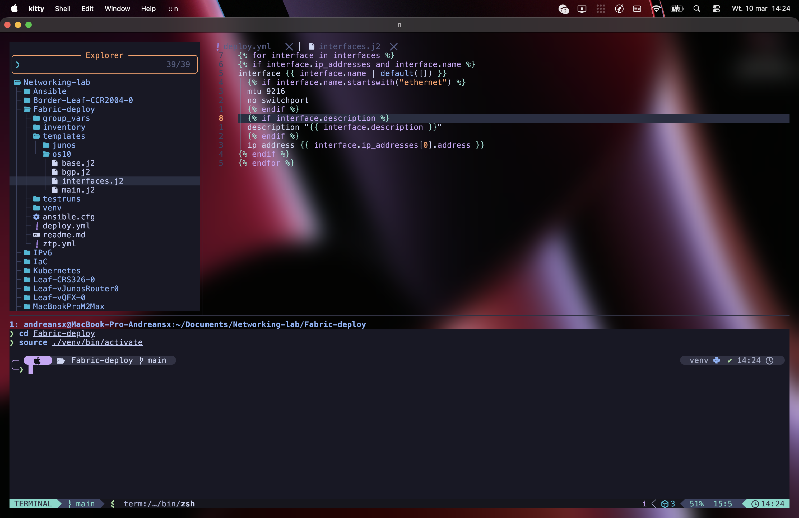
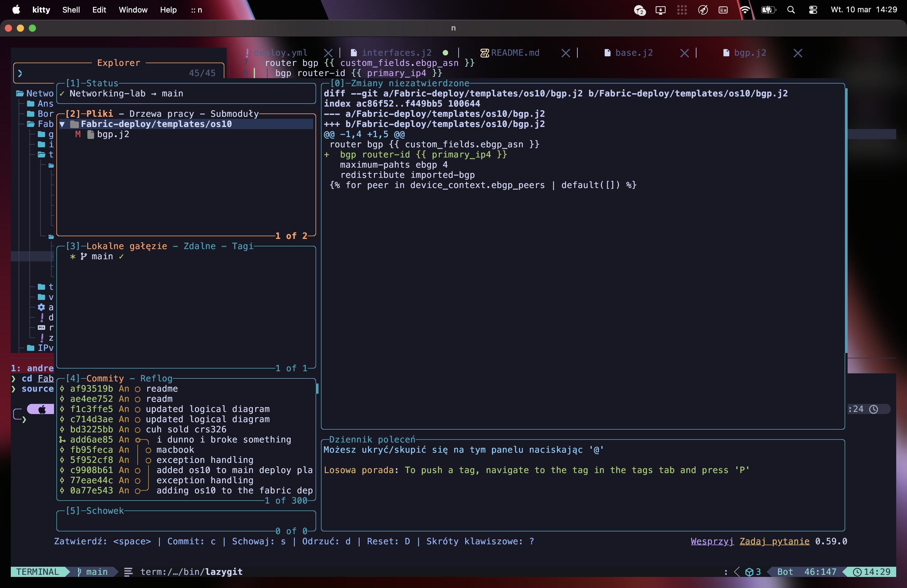
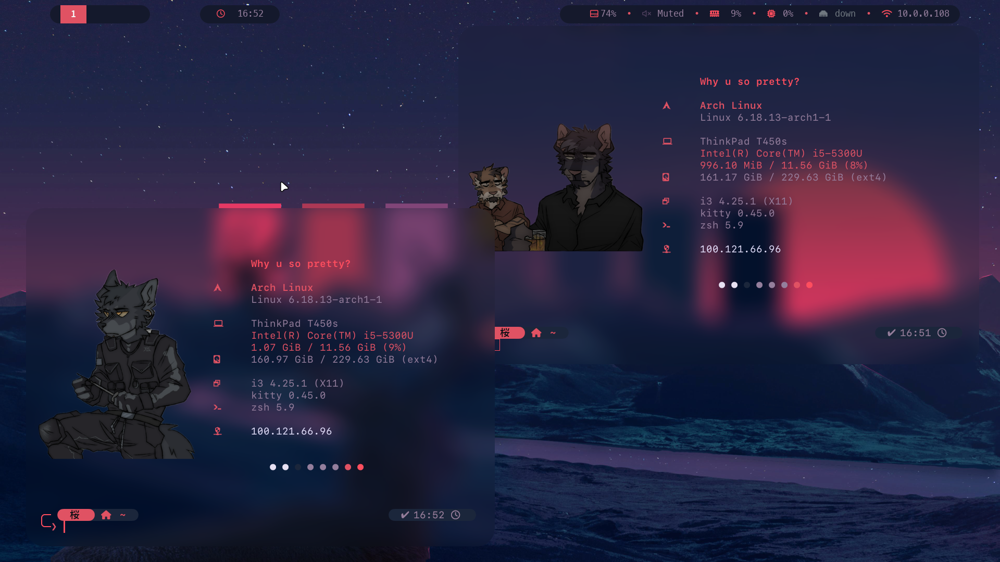
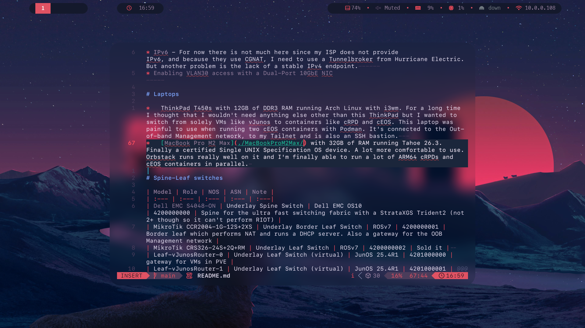

# Dotfiles


I dumped everything from Arch linux into [./archlinux/](./archlinux/)   

> [!NOTE]
> Artworks used as the fastfetch logos are **not mine**. The one on MacOS config belongs to Milplina and the ones on the Arch Linux belong to Maggotnizer.

## Main config on MacOS Tahoe 26.3.1

   
    
   

### Files

* [.zshrc](./MacOS-latest/zsh/.zshrc)   
* [nvim](./MacOS-latest/nvim/)   
* [fastfetch](./MacOS-latest/fastfetch/config.jsonc)   
* [kitty](./MacOS-latest/kitty/kitty.conf)   
* [.p10k.zsh](./MacOS-latest/zsh/.p10k.zsh)   


## My second config on MacOS Tahoe 26.3 

   
   
   

### Files 
* [.zshrc](./MacOS-v1/zsh/.zshrc)
* [nvim](./MacOS-v1/nvim/)
* [fastfetch](./MacOS-v1/fastfetch/config.jsonc)
* [kitty](./MacOS-v1/kitty/kitty.conf)
* [.p10k.zsh](./MacOS-v1/zsh/.p10k.zsh)

## Main i3wm rice on Arch Linux

This is the latest rice on my ThinkPad T450s.
    
    

### Files:   
**[picom.conf](./archlinux/picom/picom.conf)**  
**[kitty light](./archlinux/kitty/themes/light.conf)** - not used  
**[kitty dark](./archlinux/kitty/themes/dark.conf)**  
**[i3](./archlinux/i3/config)**    
**[polybar](./archlinux/polybar/config.ini)**    
**[.zshrc](./archlinux/zsh/.zshrc)**     
**[.p10k-dark.zsh](./archlinux/zsh/.p10k-dark.zsh)**    
**[.p10k-light.zsh](./archlinux/zsh/.p10k-light.zsh)** - not used      
**[fastfetch light](./archlinux/fastfetch/config-light.jsonc)** - not used  
**[fastfetch dark](./archlinux/fastfetch/config-dark.jsonc)**  
**[Lazyvim](./archlinux/nvim/)**   


### Scripts:  

**[install.sh](./scripts/install.sh)** - installs Dotfiles for archlinux   

Only for i3wm:
*   **[light-theme.zsh](./archlinux/zsh/light-theme.zsh)** - binded to Mod+Shift+P 
*   **[dark-theme.zsh](./archlinux/zsh/dark-theme.zsh)** - binded to Mod+P


What's very important is the build of picom. This is the one that works on my machine

```bash
yay -S picom-git
```
I've had problems with `picom-simpleanims-next-git` and `picom-ftlabs-git`. The issue I have found with ftlabs fork was that it could not properly handle window states, especially `NET_WM_STATE_MAXIMIZED_VERT` and `NET_WM_STATE_MAXIMIZED_HORZ`. This made it not possible for me to make the rounded corners disappear when a window gets maximized by `smart_gaps on`.

