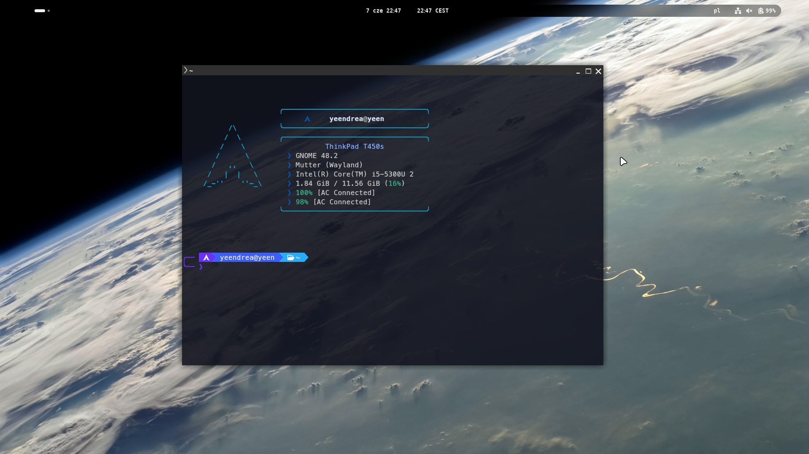
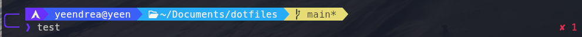
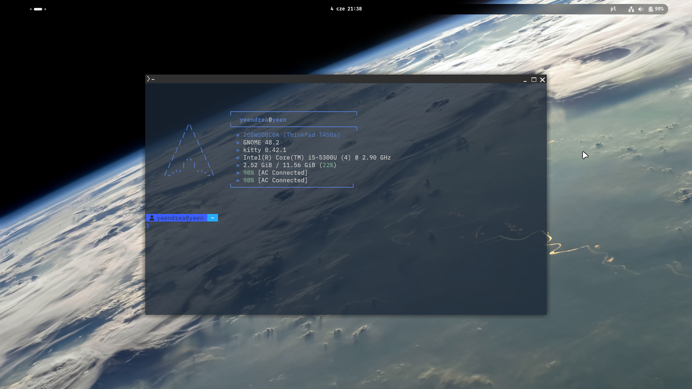

<div align="center">
<h1>My dotfiles</h1>
  

<h4>Here I share all my configuration files.</br> Everything is done on a Lenovo ThinkPad T450s with Arch Linux </h4>

</div>

>[!NOTE]
>WIP - don't have a screenshot right now

## Main rice - i3wm

**[picom.conf](./picom/picom.conf)**  
**[kitty light](./kitty/themes/light.conf)**  
**[kitty dark](./kitty/themes/dark.conf)**  
**[i3](./i3/config)**  
**[polybar](./polybar/config.ini)**  
**[.zshrc](./zsh/.zshrc) and [.p10k.zsh](./zsh/.p10k.zsh)**  
**[fastfetch light](./fastfetch/config-light.jsonc)**  
**[fastfetch dark](./fastfetch/config-dark.jsonc)**  

### Scripts:  
**[light-theme.sh](./zsh/light-theme.sh)** - binded to Mod+Shift+P 
**[dark-theme.sh](./zsh/dark-theme.sh)** - binded to Mod+P
**[install.sh](./install.sh)**

What's very important is the build of picom. This is the one that works on my machine

```bash
yay -S picom-git
```
I've had problems with `picom-simpleanims-next-git` and `picom-ftlabs-git`. The issue I have found with ftlabs fork was that it could not properly handle window states, especially `NET_WM_STATE_MAXIMIZED_VERT` and `NET_WM_STATE_MAXIMIZED_HORZ`. This made it not possible for me to make the rounded corners disappear when a window gets maximized by `smart_gaps on`.

I love this particular font from Adobe called **Source Han Sans JP** since it supports Japanese characters, which is useful in my case for making the rice prettier.  You can install it from the **AUR**
```bash
yay -S adobe-source-han-sans-jp-fonts
```
You can also use **MesloLGL Nerd Font**. 
```zsh
sudo pacman -S ttf-meslo-nerd
```

>[!IMPORTANT]
>I will try to make the repository as organised as I can but the themes and styles need to be installed manually. Maybe in some time I will make a script for installation

# 01 - main rice:



## Files
*   **[kitty.conf](./kitty/kitty.conf)**
*   **[.bashrc](./Bash/01.bashrc)**
*   **[fastfetch](./fastfetch/config1.jsonc)**
*   **[gnome-extensions](./gnome-extensions/)**
*   **[font](./fonts/BlexMonoNerdFont-Regular.ttf)**
*   **[kitty-theme](./kitty/)**

# 02:



## Files
*   **[kitty.conf](./kitty/kitty.conf)**
*   **[.bashrc](./Bash/02.bashrc)**
*   **[wallpaper](./wallpapers/IMG_3151.jpeg)**
*   **[fastfetch](./fastfetch/config2.jsonc)**

#
*   Hardware:   **ThinkPad T450s**  
*   OS: **Arch Linux**  
*   DE: **GNOME 48.2**  
*   Terminal: **Kitty 0.42.1**  
*   Terminal font: **BlexMonoNF**  
*   Cursor: **Bibata cursor Ice**


<h2>Fonts</h2>
</div>

The configuration files for Kitty require a **Nerd Font**. You can install one using `pacman`:

```bash
pacman -S ttf-meslo-nerd
```

>[!TIP]
>If the font you like isn't available in the Arch extras repository, you can grab it using `yay` or `paru`

```bash
yay -S ttf-ibmplex-mono-nerd
```
<div align="center">
